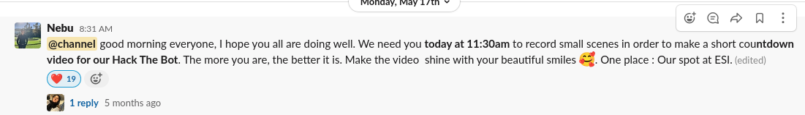
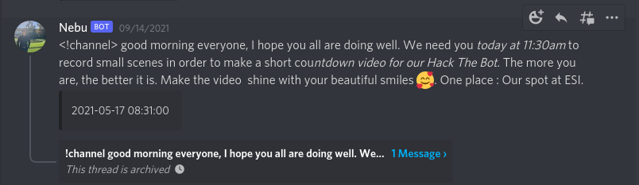

Slack to Discord

A small utility script to recover all messages sent in Slack into a Discord Server. Could be a great tool if you want to migrate from Slack to Discord without losing all the previous messages in an organized way.

Dependencies:

- Discord.py 2.x ( to be installed from source [here](https://github.com/Rapptz/discord.py)  )

Screenshots :

